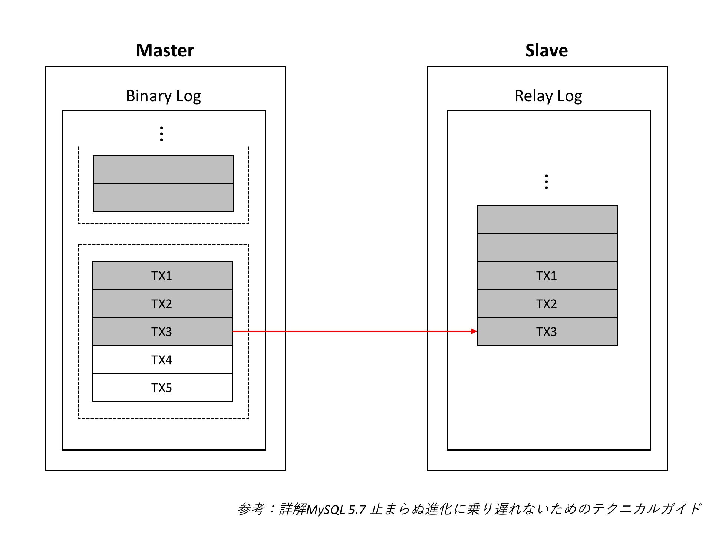

## Master Thread (Binlog Dump)의 Mutex 개선
MySQL 5.6.16 이전 버전에서 마스터에서 크래시가 발생한다면, `sync_binlog=1`로 설정이 되어 있더라도 *슬레이브에서만 데이터가 존재하는 경우가 발생할 수 있다.* 바이너리 로그를 기록할 때, 몇 개의 트랜잭션이 모아 `바이너리 로그 그룹 커밋(binary log group commit)`으로 처리하는데, 이것은 먼저 디스크 캐시로 데이터를 기록하는 `write` 단계, 그리고 캐시의 내용을 디스크로 플러시하는 `fsync`의 순서로 나누어 처리된다. 바이너리 로그 그룹 커밋 시점에 사용되는 `LOCK_log` 뮤텍스가 `write` 동작까지만 보호를 하는데, 이 때 아직 fsync가 완료되지 않은 데이터를 `마스터 스레드(Binlog Dump)`가 읽어, 슬레이브로 전송시켜버릴 수가 있다는 것이다. 만약, 이 시점에 마스터가 크래시되어 버린다면, 크래시된 마스터를 재기동 한 이후에는 바이너리 로그가 소실되어 해당 트랜잭션들은 롤백이 될텐데, 이미 슬레이브로 전송되어버린 바이너리 로그는 롤백이 되지 않고 슬레이브에서만 존재하는 데이터가 되어 버릴 수 있기 때문이다.

5.6.17 버전부터는 `LOCK_log` 뮤텍스가 `fsync`까지 보호를 유지하도록 패지가 되어, 이러한 문제는 더 이상 발생하지 않게 되었다. 하지만 이러한 조치의 의해 성능적인 문제가 다시 발생하게 되었다. `fsync`는 디스크로 데이터를 기록하기 때문에 시간이 매우 오래걸리는 작업인데, 이 시간동안 `LOCK_log`가 필요한 다른 처리들은 모두 대기를 할 수 밖에 없게 되는 것이다. 특히, `LOCK_log`는 마스터 스레드가 바이너리 로그를 읽어 슬레이브로 전송하려고 할 때에도 필요하다. 결국 마스터 슬레이브간의 데이터 부정합의 방지하는 반면, 뮤텍스 경합으로 인한 성능 문제를 야기된 것이다. 다행히도 5.7부터는 `LOCK_log` 뮤텍스를 세분화되어 뮤텍스 경합을 줄이도록 재차 개선이 되었다. 기존 마스터 스레드가 바이너리 로그를 읽기 위해 획득해야 했던 `LOCK_log` 뮤텍스 대신, `LOCK_binlog_end_pos` 뮤텍스를 획득하도록 변경되었는데, 이 뮤텍스가 보호하는 대상은 **마스터 스레드가 읽을 수 있는 fsync된 바이너리 로그 중 가장 최신의(또는 마지막)의 포지션 정보이다.** ()참고로 이전 버전에서는 특별한 제한없이 바이너리 로그 파일의 EOF까지 모두 읽을 수 있었는데, 이제 fsync가 완료된 바이너리 로그만 읽어갈 수 있게 변경이 된 것이다.) 즉, `LOCK_binlog_end_pos`가 추가시켜 `LOCK_log`의 뮤텍스 경합이 줄어들게 되었으며, fsync가 완료된 바이너리 로그로만 슬레이브 전송이 가능하도록 하여 슬레이브에서만 존재하는 데이터 역시 발생하지 않도록 된 것이다.
